# flag2vec

A flags-domain analogue of Figure 3 in [emoji2vec](https://arxiv.org/abs/1609.08359) (Eisner et al., 2016) — and an exploration of what DINOv2's visual embedding space says about national flags.

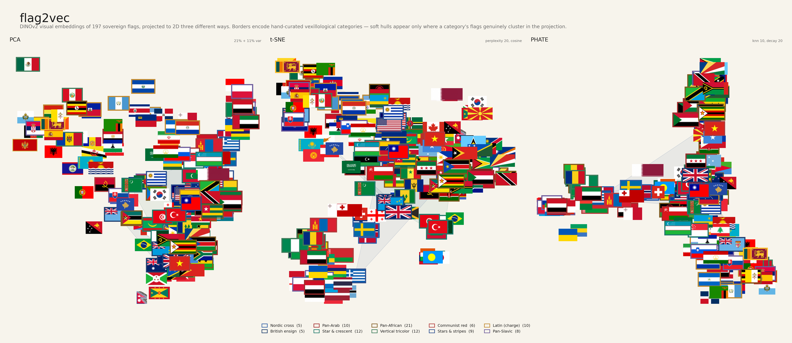

emoji2vec's Figure 3 projects 1,661 emoji embeddings to 2D with t-SNE and renders each emoji glyph at its position. Clusters of similar emojis (smileys, animals, fruits, flags) emerge from a *language*-derived embedding space — and notably, in the original paper, all the country flags pile into one undifferentiated cluster, because their Unicode keyword sets are dominated by "flag" + a country name. They're indistinguishable in language-space.

This project asks the dual question. Do *visual* embeddings of national flags recover the *cultural / heraldic / political* groupings a vexillologist would draw by hand — Nordic crosses, pan-Arab tricolor, British ensigns, French tricolor lineage, star-and-crescent, communist red, Latin American horizontal-tricolor-with-charge, and so on?

**Short answer: yes, partially.** Structurally distinctive categories (Nordic cross 64% k=5 NN purity, British ensign 60%, horizontal tricolor 58%) cluster cleanly in DINOv2 space. Color-tradition-only categories (Pan-Slavic 12%, Communist red 6%) don't — because their structural content varies too much. A linear probe on frozen DINOv2 features achieves 35% accuracy across 14 vex categories (chance ≈ 21%), beating both a color-histogram baseline (24%) and a random-feature control (19%). k-means recovers visible diagonal structure against the hand labels (ARI 0.22 / NMI 0.43). Read on for the figures.

## Method

- **Source:** [hampusborgos/country-flags](https://github.com/hampusborgos/country-flags) SVGs (MIT-licensed).
- **Scope (Phase 1):** 197 sovereign UN members + observer states (Vatican, Palestine) + Taiwan + Kosovo.
- **Rasterization:** SVG → PNG, letterboxed to 480×320 (2:3) on transparent background.
- **Embedding:** DINOv2 ViT-S/14 at 518×518, `[CLS]` token (384-dim).
- **Projections:** PCA, t-SNE (perplexity 20, cosine), PHATE (knn 10, decay 20).
- **Annotation:** hand-curated vex categories (`data/sovereign_flags.csv`) and UN regions (`data/regions.csv`).

## The hero figure

The three-panel hero (`out/latent_flags.png`, top of this README) shows all 197 flags rendered at their 2D positions in PCA, t-SNE, and PHATE, with thin colored borders for hand-curated vex categories. Soft hulls appear only where a category genuinely clusters in the projection — `compactness < 0.65 × global mean pairwise distance` — keeping the figure honest.

## By projection

Three larger single-projection figures, one per method:

| | |
|---|---|
| **PCA** — 21% + 11% variance | [`out/projections/pca.png`](out/projections/pca.png) |
| **t-SNE** — perplexity 20, cosine | [`out/projections/tsne.png`](out/projections/tsne.png) |
| **PHATE** — knn 10, decay 20 | [`out/projections/phate.png`](out/projections/phate.png) |

PCA's top two components capture 32% of variance and read roughly as a *color/contrast* axis (high-contrast bicolors at one extreme, washed-out heraldic at the other) versus a *structural complexity* axis (plain fields → multi-element). t-SNE and PHATE separate clusters more crisply but PCA is the most honest about distances — pairs nearby in PCA really are nearby in 384-dim DINOv2 space.

## By vex category

`out/categories/<category>.png` — one figure per category, with that category highlighted across all three projections, the rest faded to grayscale. Compactness numbers per panel make it instantly visible which categories cluster in which projections.

The clearest stories:
- **Nordic cross** — tightest cluster across all three projections. Sweden, Denmark, Norway, Iceland, Finland are visual near-twins to DINOv2.
- **British ensign** — UK, Australia, New Zealand, Fiji, Tuvalu cluster despite very different fly designs.
- **Pan-Arab** — clean cluster anchored on the red/white/black/green horizontal tricolor base.
- **Pan-African** — diffuse. The category includes vertical tricolors (Mali, Senegal), horizontal tricolors (Ethiopia, Ghana), six-stripers (Uganda) and AK-47-bearing flags (Mozambique). DINOv2 sees them as *visually heterogeneous*, even though they share a heritage.
- **Pan-Slavic** — also diffuse, for the same reason: red/white/blue gets used in horizontal tricolors of varied stripe orderings, with very different state symbols on top.
- **Communist red** — almost zero clustering. China, Vietnam, North Korea, Belarus, Mongolia, Angola differ enormously in structure beyond "red field."

## By geographic region

`out/regions/<region>.png` — Africa / Americas / Asia / Europe / Oceania, same highlight treatment.

Region clustering is *much weaker* than vex-category clustering. Europe's compactness is ~1.0 (≈ no preference) — European flags span the gamut from Nordic cross to Mediterranean tricolor to Slavic patterns to British ensign-style. Africa is similarly diffuse. The strongest geographic signal is **Latin America** within Americas: their horizontal-tricolor-with-central-charge convention forms a tight visual subcluster. **Western Asia / MENA** also clusters tightly via shared pan-Arab heritage. Geographic similarity is driven by political/cultural traditions inside the region, not by region itself.

## Quantitative analyses

`out/analysis/` contains a suite of figures probing the embedding from different angles.

### k-NN purity by category — the headline

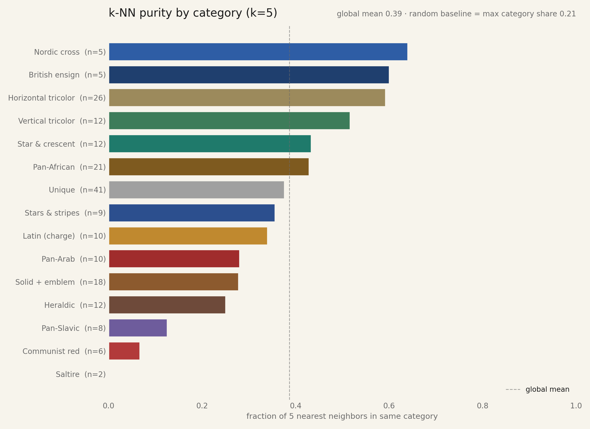

For each flag, what fraction of its k=5 nearest neighbors share its hand-labeled vex category? Random baseline ≈ 0.21 (size of the largest category). DINOv2 mean = 0.39, with a clear ranking: structural categories beat color-tradition categories.

### "Most prototypical flag" per category

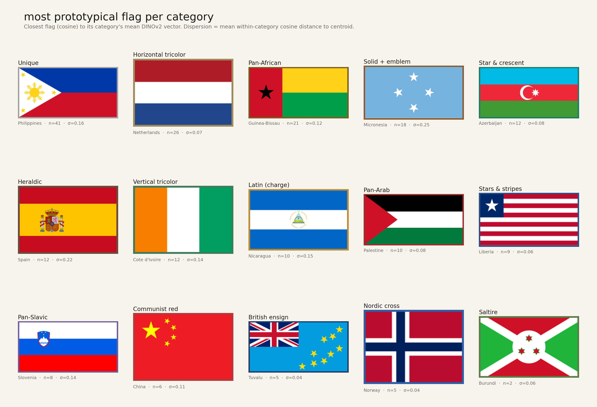

For each vex category, the flag whose DINOv2 vector is closest (cosine) to the mean of its category. The Netherlands as the prototypical horizontal tricolor (it *invented* the form). Norway as the prototypical Nordic cross. Liberia as the prototypical stars-and-stripes (a US-derived flag). Tuvalu as the prototypical British ensign. Côte d'Ivoire as the prototypical vertical tricolor. China as the prototypical communist-red. These are not cherry-picked — they fall out of the embedding.

### Most-distant flag pairs

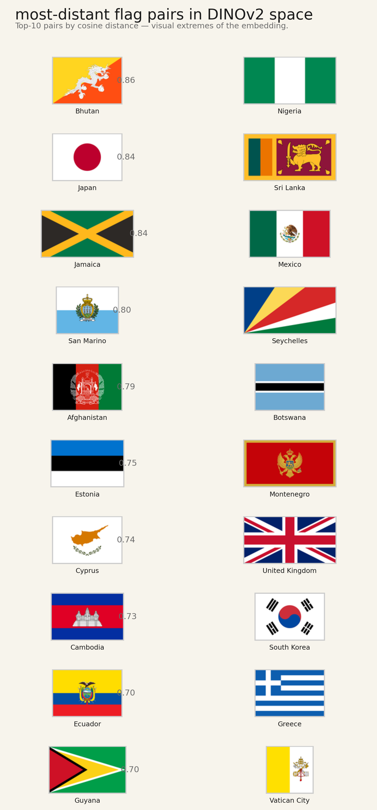

The 10 pairs of flags with the largest cosine distance in DINOv2 space — visual extremes of the dataset.

### Nearest cross-category neighbors

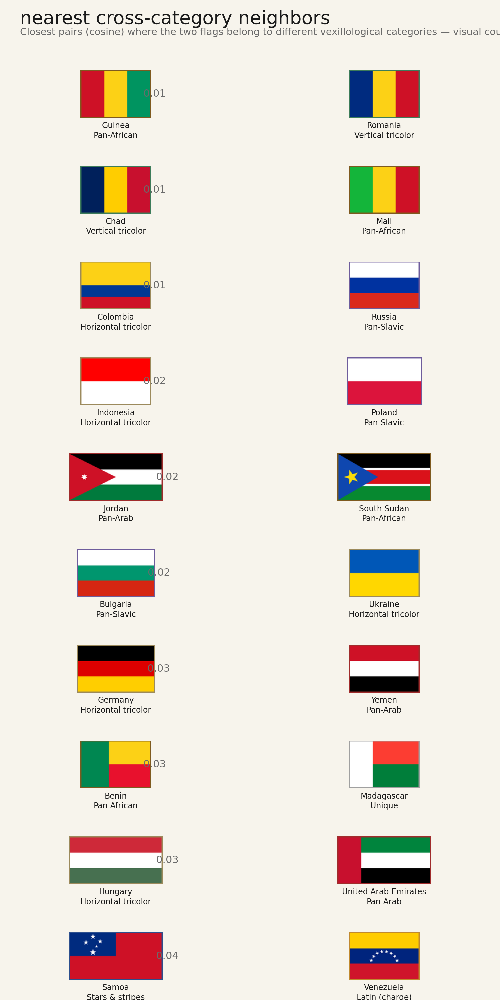

The closest pairs whose two flags belong to *different* vex categories — visual cousins across symbol-family boundaries. Guinea (Pan-African) ↔ Romania (Vertical tricolor), Chad ↔ Mali, Colombia ↔ Russia: at this distance, the categorical line is pure heritage, not appearance.

### Most visually unique flags (LOF)

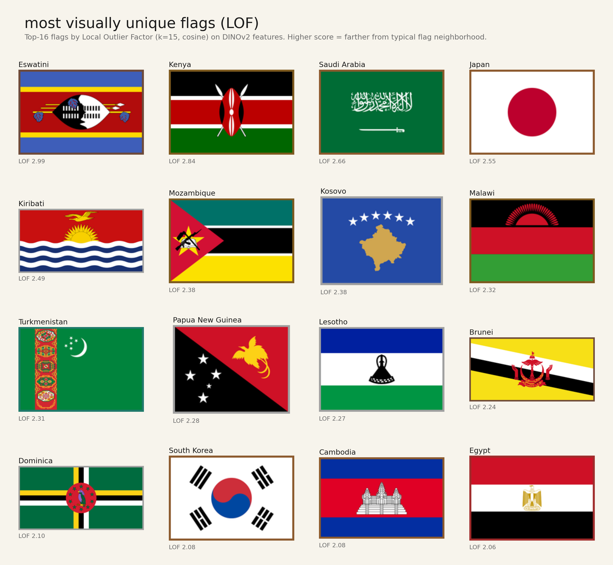

Local Outlier Factor (k=15, cosine) on DINOv2 features. Eswatini, Kenya, Saudi Arabia, Japan, Kiribati, Mozambique, Kosovo, Malawi — the flags that sit farthest from any visual neighborhood. These are the "irreducible" flags of the dataset.

### k-means vs vexillology — confusion matrix

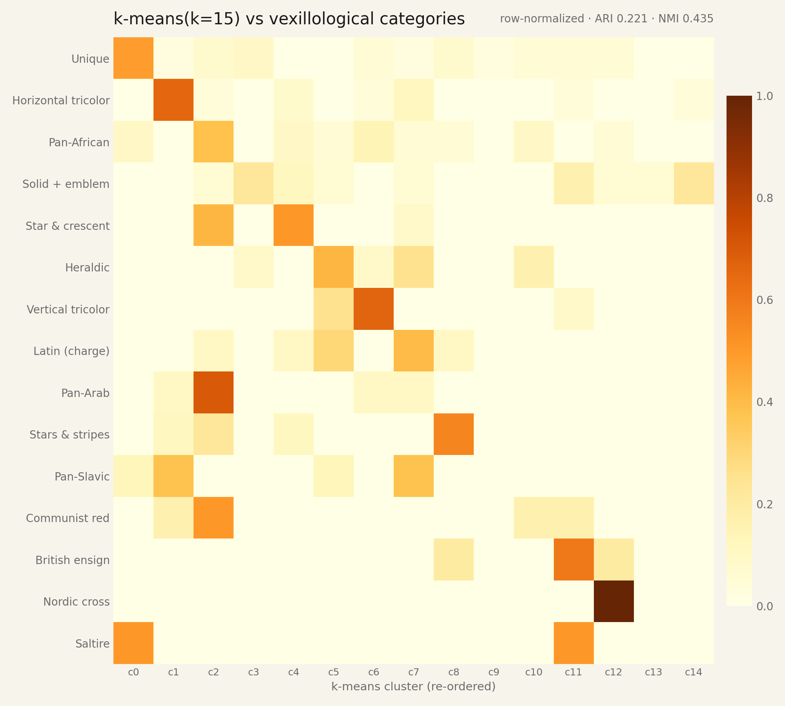

k-means(k=15) on the 384-dim embeddings, then row-normalize against hand vex labels (each kmeans cluster reordered to maximize diagonal). ARI ≈ 0.18 / NMI ≈ 0.40 — significant agreement (well above random null ≈ 0) but far from a perfect match. The off-diagonals tell where DINOv2 disagrees with vexillology.

### Cluster quality vs k

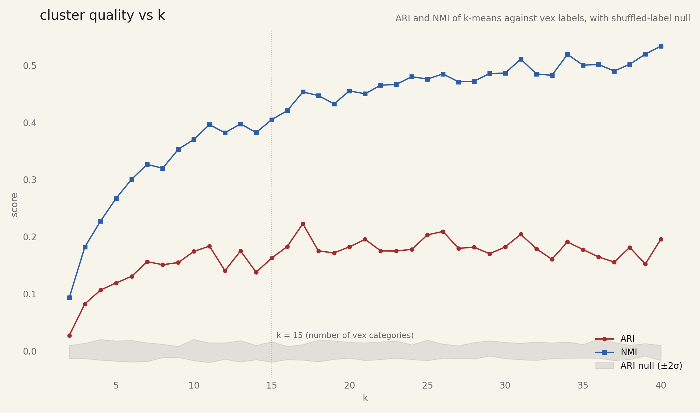

ARI plateaus around k=11–25 at ~0.20, while NMI keeps climbing through k=40. The gray null band is ARI under shuffled labels (mean ≈ 0). DINOv2's clustering doesn't have a single sharp natural granularity that matches the 15-category taxonomy — it has *more* fine structure than the labels capture.

### Linear probe — how separable is vex structure?

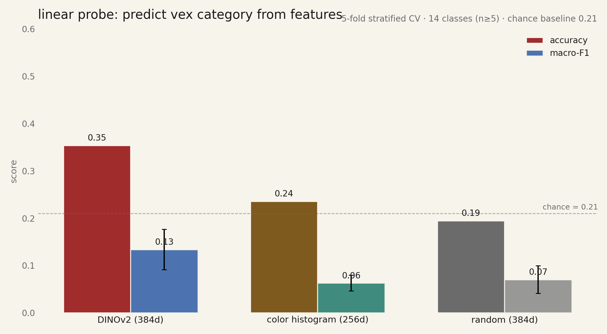

Logistic regression (5-fold stratified CV, classes with n≥5) predicting vex category from features. DINOv2 reaches 35% accuracy / 0.13 macro-F1, beating the color-histogram baseline (24% / 0.06) and random features (19% / 0.07). Macro-F1 is suppressed by the long-tail classes (Nordic cross n=5, British ensign n=5, etc., where 5-fold CV gives 1 sample per class per fold). Accuracy is the more meaningful headline here.

### Pairwise distance histograms

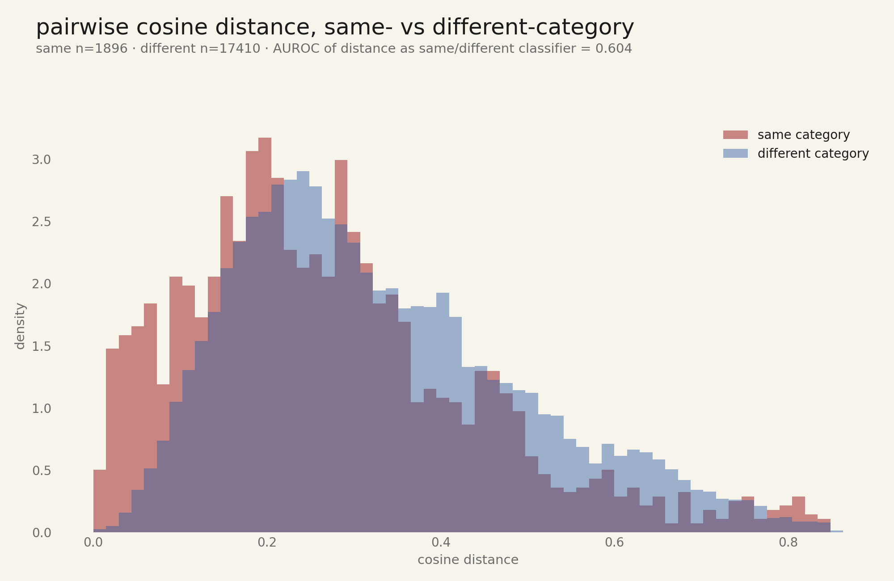

Same-category vs different-category cosine distances. AUROC of distance as a same/different classifier ≈ 0.60 — meaningful signal but heavy overlap. The visible left tail in same-category distances is the "near-twin" pairs (Nordic crosses with each other, near-identical pan-Arab tricolors).

### k-NN purity vs PCA-reduced dimensionality

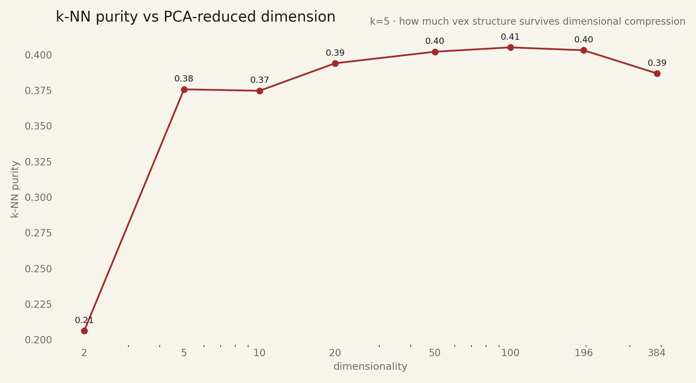

k=5 NN purity rises sharply from 0.21 at d=2 (≈ chance) to 0.38 at d=5, plateaus through d=100 at ~0.40, and at full d=384 sits at 0.39. The 2D projections (t-SNE / PHATE / PCA, what the hero figures actually render) retain only ~half the vex structure of the full embedding — which sets a ceiling on what visual inspection of the 2D plots can reveal.

### Mutual information across metadata

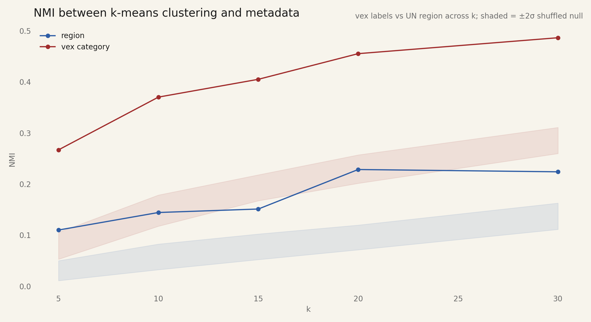

NMI between k-means clusters and three independent label sets — vex categories vs UN regions, swept across k. DINOv2 organizes flags by vex symbolism much more strongly than by geography.

### Color count vs distance from global centroid

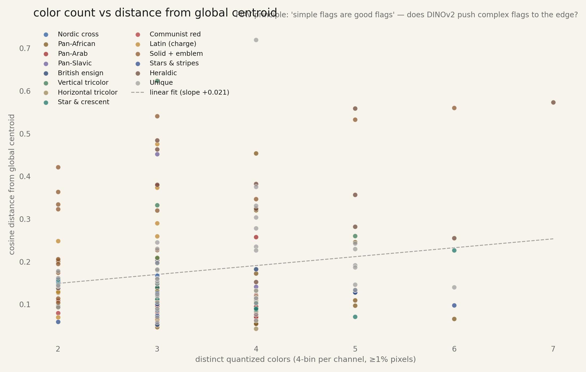

A test of FIAV's design principle "keep it simple." Does DINOv2 push complex flags (more distinct colors) toward the periphery? The slope is mild — color count alone doesn't drive embedding position much.

### Symmetry vs t-SNE position

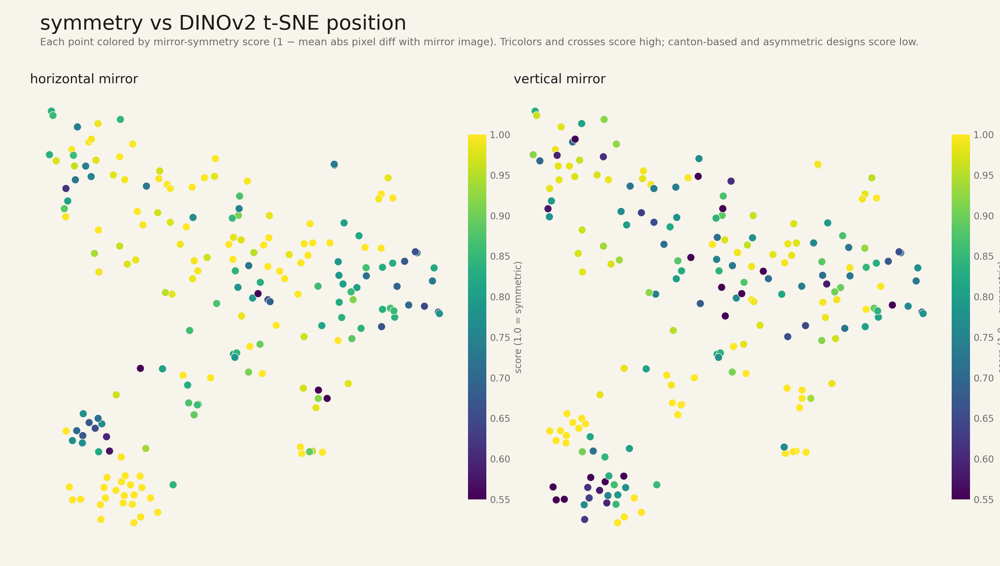

Each flag colored by horizontal- and vertical-mirror symmetry score. Tricolors and crosses score high on at least one axis; canton-based and asymmetric designs (British ensigns, USA, Tonga) score low.

### Average flag per category — four ways

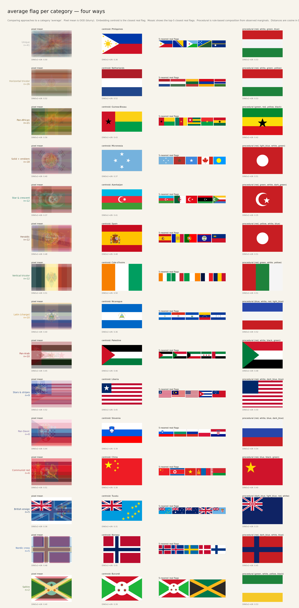

The naive way to compute a category average is to mean the pixel values — which produces a blurry, *off-manifold* image (DINOv2 has never seen a flag that smudgy). Four approaches here, with each row showing one category:

1. **Pixel mean** — naive averaging. Looks washed-out; embeds far from the cluster it represents.
2. **Embedding centroid** — the real flag whose DINOv2 vector is closest to the category's mean. This is on-manifold by definition.
3. **5-nearest mosaic** — the five real flags closest to the centroid. Gives a sense of the cloud, not just the point.
4. **Procedural composition** — rule-based SVG generation: pick the canonical pattern for that category (Nordic cross / pan-Arab triangle+stripes / British ensign / horizontal tricolor) and color-sample from the category's observed palette frequencies. Also on-manifold — a synthetic flag that *could exist*.

### Average flag → UN flag

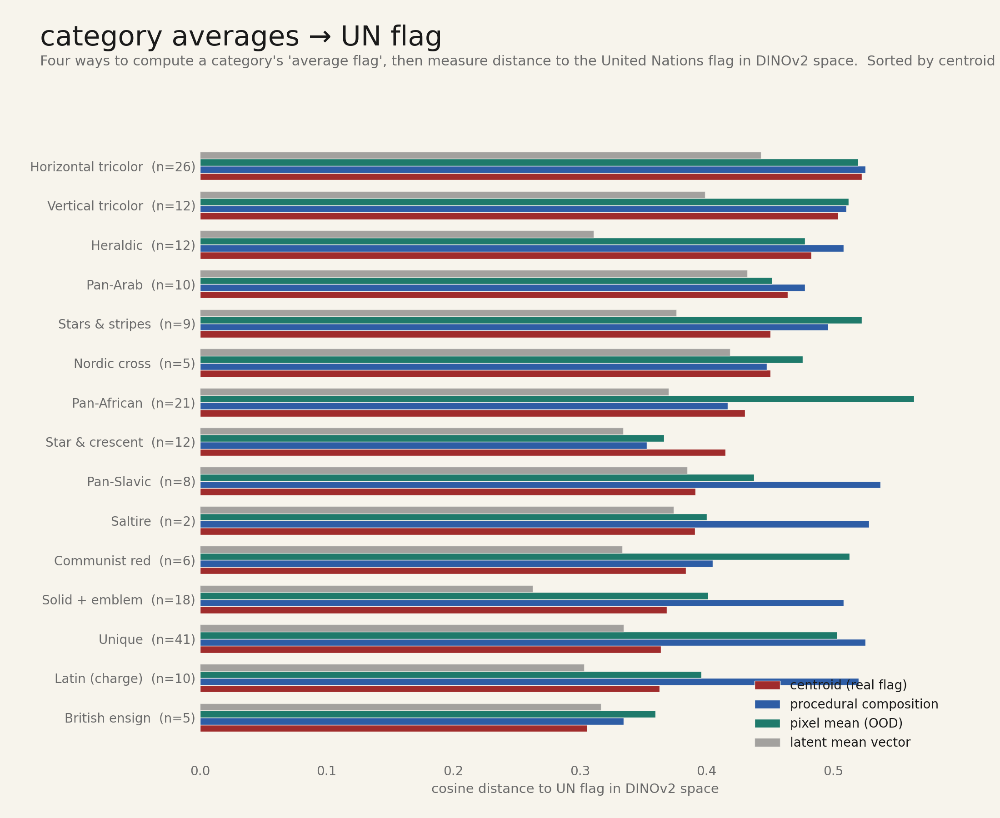

How far is each category's average flag from the United Nations flag (light blue field with white globe-and-olive-branches emblem) in DINOv2 space? Sorted by centroid distance.

Surprising winner: **British ensign** is closest (0.31). The UN flag is essentially a "blue field with white emblem"; UK ensigns are also "blue field with white-and-colored insignia in canton" — DINOv2 sees the structural rhyme. Latin (charge), Solid+emblem, and Communist red follow. Horizontal tricolor and Vertical tricolor sit farthest — pure stripes don't have the field+emblem structure UN does.

The procedural ("on-manifold rule-based") and centroid ("on-manifold real flag") distances tend to agree closely. The pixel-mean and latent-mean-vector approaches are systematically *closer* to UN than the on-manifold approaches — but only because they collapse to a smudgy direction in vector space that no real flag ever lives at. They're shorter-distance shortcuts that don't correspond to anything real. The point of the on-manifold approaches is that the resulting "average flag" is *itself an interpretable flag*.

### Procedural average flags

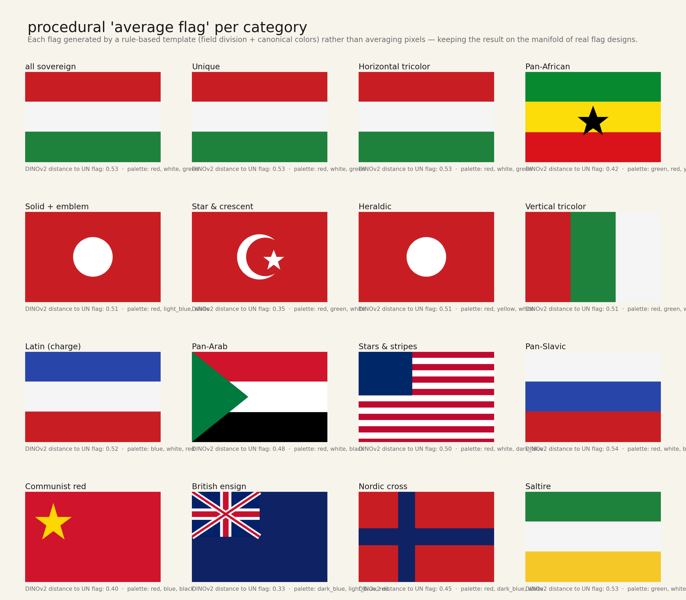

The full set of rule-based "average flags" — what a typical flag from each category looks like, generated by composing field-division templates (horizontal-tricolor / vertical-tricolor / Nordic-cross / pan-Arab-triangle / British-ensign / communist-red / star-and-crescent / solid+emblem / stars-and-stripes) with the category's most-frequent palette colors. Bonus: "all sovereign" gets a global procedural that uses the dominant pattern (horizontal tricolor, n=26) and palette (red/white/green).

### Hierarchical clustering dendrogram

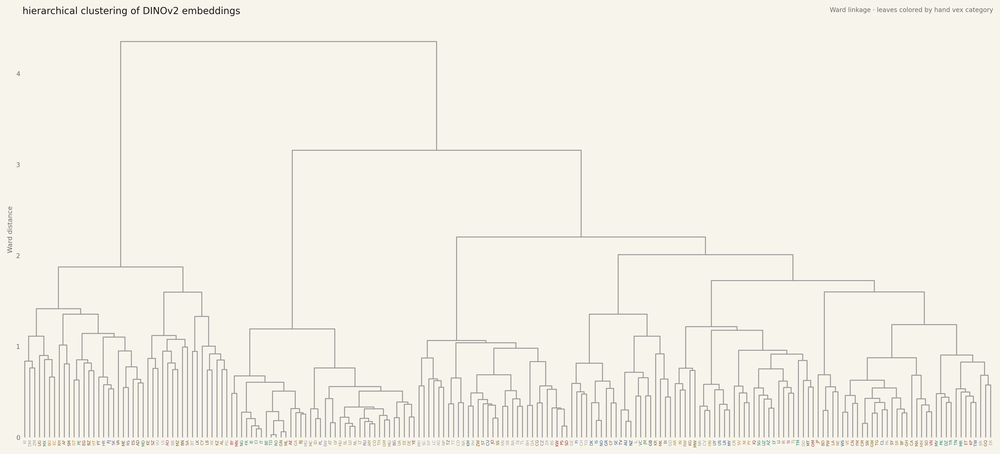

Ward-linkage hierarchical clustering on the full 384-dim space, leaves colored by vex category. The Nordic-cross subtree, the Pan-Arab subtree, and the British-ensign subtree are all visible as monochromatic spans.

## Phase 2 — non-sovereign flags

201 subdivision flags joined the embedding alongside the 197 sovereigns: 57 US states/territories, 47 Japanese prefectures, 27 Brazilian states, 26 Swiss cantons, 16 German Länder, 13 Canadian provinces/territories, 8 Australian states/territories, 4 UK constituent countries, plus Greenland, the Faroe Islands, and Åland (the Nordic autonomous regions). Vendored from [amckenna41/iso3166-flags](https://github.com/amckenna41/iso3166-flags) and [google/region-flags](https://github.com/google/region-flags).

### Joint hero

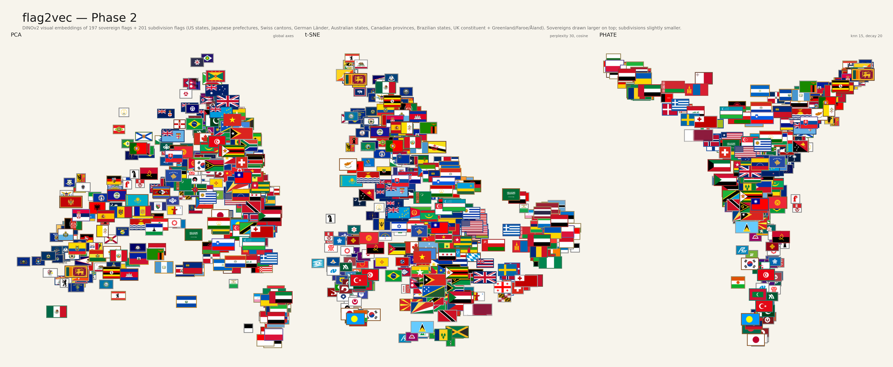

All 398 flags in DINOv2 space, sovereigns drawn slightly larger and on top, subdivisions slightly smaller behind. PCA / t-SNE / PHATE side-by-side.

### Per-country highlights

Drilling into each country's subdivisions: the parent national flag is drawn extra-large with a gold border so you can see where the parent sits relative to the cluster.

| | n | compactness (lower = tighter) | k-NN lift over chance | |
|---|---:|---:|---:|---|
| Australia      |  8 | 0.54 | 31× | [`out/phase2/subdivisions_by_country/AU.png`](out/phase2/subdivisions_by_country/AU.png) |
| Japan          | 47 | 0.75 |  5.4× | [`JP.png`](out/phase2/subdivisions_by_country/JP.png) |
| Brazil         | 27 | 0.75 |  2.7× | [`BR.png`](out/phase2/subdivisions_by_country/BR.png) |
| Canada         | 13 | 1.05 |  2.5× | [`CA.png`](out/phase2/subdivisions_by_country/CA.png) |
| Germany        | 16 | 1.07 |  4.6× | [`DE.png`](out/phase2/subdivisions_by_country/DE.png) |
| Switzerland    | 26 | 1.27 |  7.1× | [`CH.png`](out/phase2/subdivisions_by_country/CH.png) |
| United States  | 57 | 1.27 |  3.0× | [`US.png`](out/phase2/subdivisions_by_country/US.png) |

### Subdivision compactness

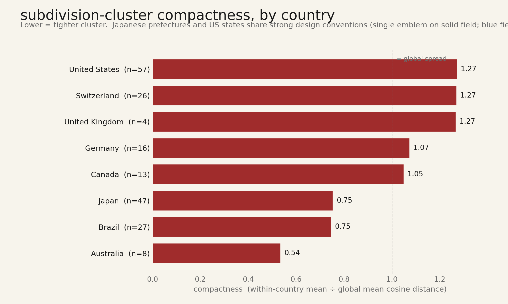

Mean within-country pairwise cosine distance ÷ global mean. **Australia** is the tightest (0.54): all 8 of its state/territory flags are British-ensign-derived blue fields, and DINOv2 puts them right next to each other. **Japan** and **Brazil** are next, the prefectures and Brazilian states sharing strong national conventions. **US, Switzerland, UK** sit *above* global spread — meaning US states are, on average, *farther* from each other than two random flags are. The "blue-field-with-state-seal" convention is much weaker than it looks at a glance, because the seals themselves vary enormously (Maryland, New Mexico, Texas, California are all wildly distinct).

### k-NN lift over chance

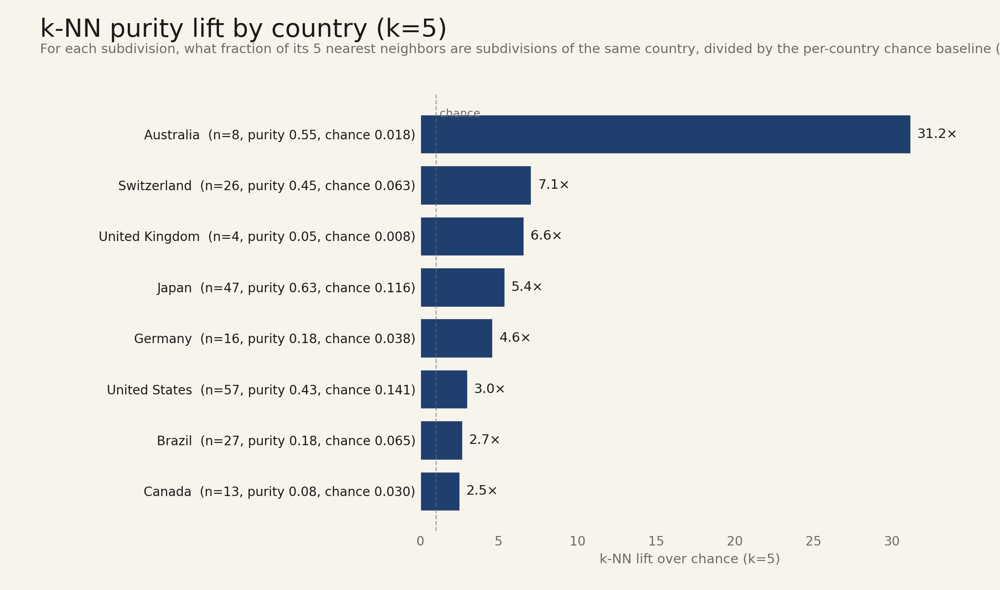

Compactness undersells the within-country convention because it averages all pairwise distances. **k-NN lift** compares the fraction of each subdivision's 5 nearest neighbors that come from the same country to the per-country chance baseline. Every subdivision set lifts well above chance: **Australia 31×**, **Switzerland 7×**, **UK 7×**, **Japan 5×**, **Germany 5×**, **US 3×**, **Brazil/Canada ≈ 2.5×**. Even visually-varied sets (Switzerland's heraldic miniatures, the four UK home nations) have neighborhoods full of their siblings — DINOv2 sees the family resemblance even when the global spread is wide.

### Subdivision → national flag distance

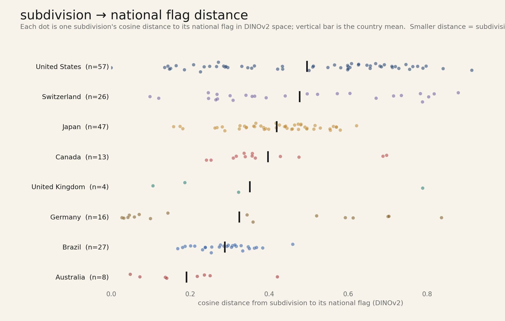

Each dot is one subdivision's cosine distance to its parent national flag in DINOv2 space; the vertical bar is the country mean. Australia's state flags are *closest* to their parent (they are British ensigns, like the AU national flag itself). Japan's mean is also low. The UK's is high — the Union Jack is visually unrelated to the St George's Cross, the saltire of St Andrew, the Welsh dragon, or the Ulster Banner.

## Phase 4 — Mars-terraformed flags

A creative-cartography spin-off. Year ~2300. Two centuries into Martian terraforming, the surface has cooled into something a settler might call habitable: thin nitrogen-argon air, a sub-zero polar tundra, sage-green algal rivers in the equatorial canyons, and a sky that softens to dusty pink at dawn instead of the iron-black of the Hesperian. Twenty-five regional governments — newly seated under the Areocentric Compact — commission their first flags.

Each region inherits an Earth flag tradition based on a defensible analogy (climate, terrain, settlement order, function), then layers Mars-specific motifs on top. The question this phase asks: when DINOv2 embeds the resulting Mars flags alongside the 197 Earth sovereigns + 201 subdivisions, **does each Mars flag actually land near its predicted Earth tradition's cluster?**

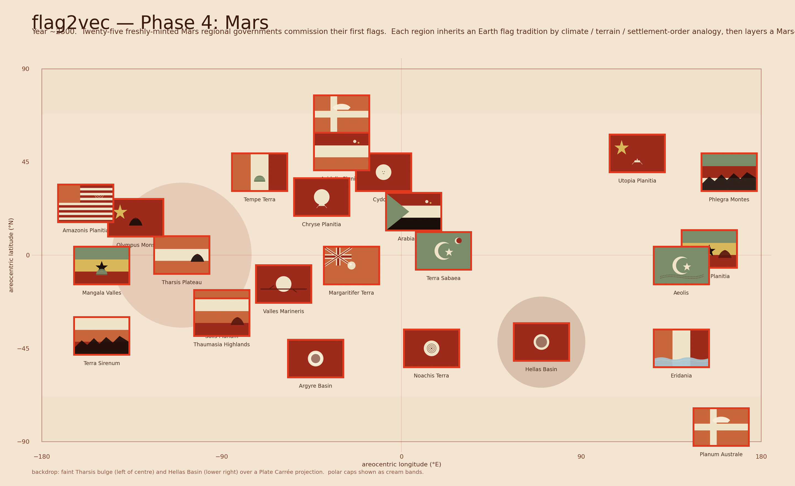

The 25 inheritance choices are documented in `data/mars_regions.csv` and the underlying Earth-tradition geography in [`out/mars/earth_traditions.md`](out/mars/earth_traditions.md). Sample inheritances:

- **Vastitas Borealis** (north polar lowland, formerly hypothesized frozen ocean) → **Nordic cross.** Climate parallel.
- **Arabia Terra** → **Pan-Arab.** The toponym is irresistible; the Compact's naming committee leaned in.
- **Tharsis Plateau** (volcanic highland, the Andean parallel) → **Latin (charge).** Highland federation founded by post-independence settlers.
- **Utopia Planitia** (Tianwen-1 + Viking 2 site) → **Communist red.** Treaty commemoration of the 2021 Chinese landing.
- **Margaritifer Terra** ("pearl-bearing land") → **British ensign.** Maritime trade-route imagery; settled in waves by an ocean-going power.
- **Cydonia** (the Face on Mars region) → **Solid + emblem.** The apocryphal Face takes the central charge.

### Procedural generation

`scripts/17_mars_generate.py` reuses the `CATEGORY_TEMPLATES` from `scripts/11_average_flags.py` (factored into `scripts/_earth_templates.py` for clean import). Each Mars flag is built in three stages:

1. **Earth template.** Pick the inherited tradition's SVG template (e.g. `template_pan_arab` for Arabia Terra).
2. **Mars palette transformer.** Substitute every hex color in the SVG with its nearest Mars equivalent: blue → rust-orange (no blue under a barely-terraformed sky), white → pale-cream (dusty haze), green → sage (the only plausible terraformed flora green), red → iron-red (regolith), yellow → sulfur (Tharsis sulfate evaporite). Each flag also receives at least one Mars-specific accent — ice-cyan for subsurface H₂O ice, dark basalt for volcanic terrain, etc.
3. **Mars overlay.** Inject a region-specific SVG fragment: Olympus Mons silhouette, polar cap, Phobos+Deimos pair, dust-storm spiral, Valles Marineris canyon line, Viking-style lander, Sun disc, "Face" silhouette, or a few others. Overlays kept ≤25% of canvas.

### Embed sanity-check

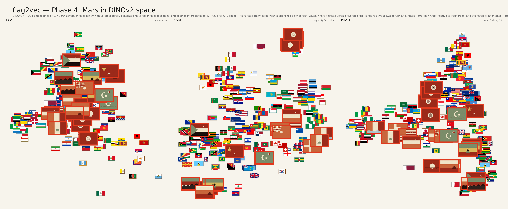

`scripts/18_mars_embed.py` embeds the 25 Mars flags via the same DINOv2 ViT-S/14 used in Phase 1/2 (positional embeddings interpolated to a smaller 224×224 input for CPU speed — internally consistent because every flag in the joint analysis passes through the same resolution; the Phase 1/2 figures keep their original 518×518 embeddings under `data/embeddings/`). The 197 sovereign flags + 25 Mars flags are projected jointly with PCA / t-SNE / PHATE. For each Mars flag, the script then computes cosine distance to the centroid of every Earth tradition. Subdivisions are deliberately excluded from the centroids — they inherit their parent's hand-label, which would distort the within-tradition averages.

A **hit** = the inherited tradition is the *nearest* of the 12 Earth tradition centroids in DINOv2 space (3 of the 15 vex categories — `unique`, `saltire`, `british_ensign`-as-sovereign-only — collapse small enough that their centroids are wobbly; reported separately as part of the per-region table).

**Headline result: 13/25 = 52% top-1 hit rate, 17/25 = 68% top-3 hit rate; lift ≈ 4.7× over chance.**

The hits cluster on the structurally distinctive traditions (Nordic cross 2/2, solid+emblem 3/3, vertical tricolor 2/2, star & crescent 2/2, plus the singletons pan-Arab, communist red, stars & stripes, horizontal tricolor — all hit rank 1). The misses cluster on the *exact* set Phase 1 flagged as visually heterogeneous: heraldic 0/3, pan-African 0/2, pan-Slavic 0/2, latin (charge) 0/2, plus the singleton british_ensign and saltire. The DINOv2 embedding is sensitive to the form of the Earth template, and the Mars palette transformation propagates that sensitivity: when a tradition's *form* is consistent on Earth, the Mars descendant lands near its ancestor; when the tradition is held together by *color tradition only*, the descendant scatters.

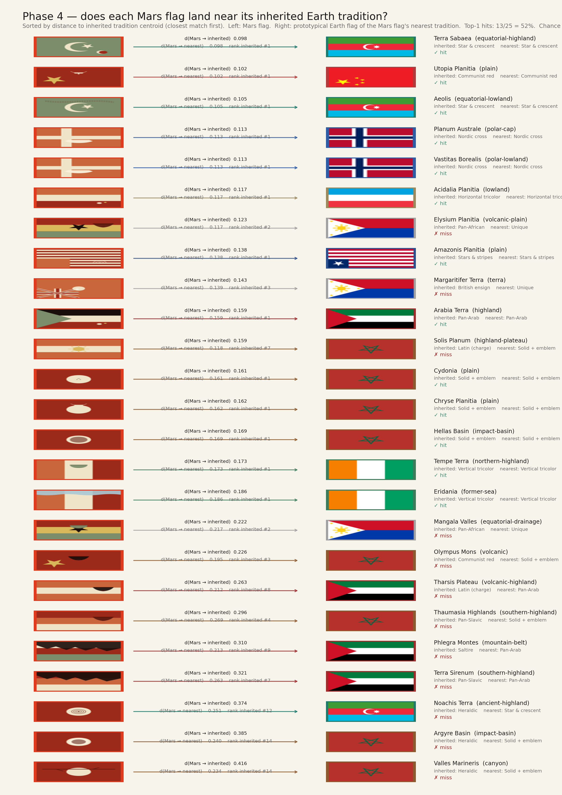

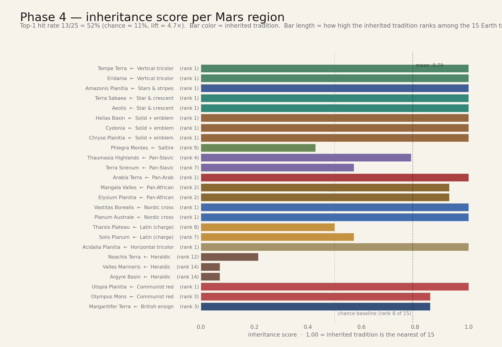

The inheritance-check strip-figure sorts Mars regions by how close they landed to their inherited tradition, with the prototypical Earth flag of the Mars flag's *actual* nearest tradition shown alongside. The hit-rate bar uses a continuous score (rank 1 of 15 = score 1.0, rank 8 ≈ chance) so structurally-correct-but-not-top-1 inheritances are visible as partial credit instead of binary misses.

A few specific failure modes are vexillologically informative. The three **heraldic** inheritances (Argyre, Marineris, Noachis) all collapsed onto `solid_emblem` or `star_crescent` — the heraldic template's medieval coat-of-arms is reduced by the templating system to "single field + central charge", which is structurally indistinguishable from solid+emblem. The two **pan-African** inheritances (Elysium, Mangala) landed on `unique` rather than pan-African — the Ethiopian tricolor + black star was preserved structurally but the Mars palette pushed the green band into sage and the yellow into sulfur, dragging the joint embedding away from the Ghana / Senegal / Mali centroid and into the residual cluster of "doesn't look like anything else." The single **british ensign** inheritance (Margaritifer) missed for a related reason: the canton design is heavy enough that the Mars repaint distinguishes it from the (very tight) Earth UK / Australia / NZ / Fiji / Tuvalu cluster.

### Files

```
out/mars/
  earth_traditions.md         # 15 vex categories: where each dominates on Earth + emergence dates
  mars_map.png                # 25 flags placed at lat/long over Mars topographic backdrop
  joint_embedding.png         # 3-panel PCA/t-SNE/PHATE, Earth+Mars, Mars highlighted
  inheritance_check.png       # per-Mars-flag → nearest Earth tradition centroid strip
  inheritance_hit_rate.png    # bar chart of inherited-tradition rank
  flags/<region_id>.png       # the 25 generated Mars flags
data/
  mars_regions.csv            # 25 regions with feature_type, lat/long, inherited tradition
  mars_embeddings.npy         # DINOv2 embeddings of the 25 Mars flags
  mars_distance_table.csv     # per-region distance to inherited + nearest tradition
  projections/projections_all_phase4.parquet  # joint PCA/t-SNE/PHATE coords
scripts/
  _earth_templates.py         # CATEGORY_TEMPLATES, importable
  _mars_lib.py                # palette transformer + overlay registry + render utility
  17_mars_generate.py         # generate Mars flags
  18_mars_embed.py            # DINOv2 embed + hit-rate analysis
  19_mars_render.py           # the four figures
```

## Phase plan

- **Phase 1** — sovereign / observer states, 197 flags. *Shipped.*
- **Phase 2** — major subdivisions, 201 flags. *Shipped.*
- **Phase 3** — historical flags (USSR, Yugoslavia, Czechoslovakia, Rhodesia, Apartheid SA, French royal banners, Confederate, pre-1991 Eastern Bloc, Ottoman). Trajectories from historical flag → modern successor visualized as arrows in latent space.
- **Phase 4** — Mars-terraformed flags. *Shipped.* See above.

## Run

```bash
python -m venv .venv && source .venv/bin/activate
pip install -r requirements.txt

python scripts/02_rasterize.py        # 197 PNGs
python scripts/03_embed.py            # DINOv2 -> data/embeddings/
python scripts/04_project.py          # PCA / t-SNE / PHATE
python scripts/05_render.py           # hero figure
python scripts/06_per_projection.py   # 3 single-projection figures
python scripts/07_per_category.py     # 15 vex-category highlight figures
python scripts/08_per_region.py       # 5 region highlight figures
python scripts/09_clustering.py       # quantitative metric figures
python scripts/10_galleries.py        # image-based galleries
python scripts/11_average_flags.py    # avg-flag analysis vs UN flag

# Phase 2 — joint with subdivisions
python scripts/12_build_subdivision_csv.py  # build subdivision_flags.csv
python scripts/13_phase2_pipeline.py        # rasterize + embed + project + render
python scripts/14_phase2_findings.py        # subdivision-specific findings

# Phase 4 — Mars
python scripts/17_mars_generate.py          # 25 Mars flags
python scripts/18_mars_embed.py             # embed + hit-rate analysis
python scripts/19_mars_render.py            # mars_map / joint_embedding / inheritance_check / inheritance_hit_rate
```

CPU-only inference. End-to-end runs in ~20 min on a 2-core machine.

## Why the name

A nod to [emoji2vec](https://arxiv.org/abs/1609.08359) — same construction, different domain, opposite question.

## License

MIT for code. Flag SVGs are MIT-licensed via [hampusborgos/country-flags](https://github.com/hampusborgos/country-flags).
